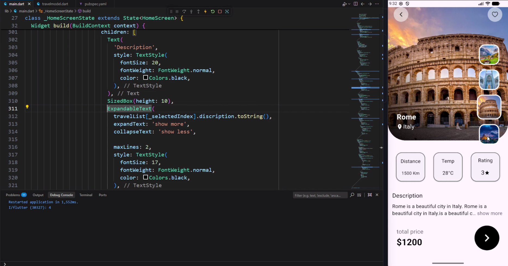

# ✈️ Travel App UI - Flutter

A modern, elegant, and responsive **Travel Destination App UI** built with Flutter, inspired by clean mobile Figma designs.

---

## 📸 Preview

<p align="center">
  
</p>

---

## ✨ Features

- **Hero Image with Custom Gradient Overlay:** Smooth dark fade (`LinearGradient`) at the bottom of the destination image for clear typography readability.
- **Dynamic Destination Selector:** Vertical destination selector to browse through different countries and cities (Switzerland, Iran, Rome, Istanbul).
- **Key Metrics Display:** Custom styled cards showcasing essential trip details:
  - 📍 Distance (km)
  - 🌤️ Temperature (°C)
  - ⭐ Rating
- **Expandable Description:** Interactive "Show more / Show less" text expansion powered by `expandable_text`.
- **Price & Booking Action:** Prominent pricing display with smooth call-to-action button.
- **Clean Widget Architecture:** Well-structured widgets with responsive sizing using `MediaQuery`.

---

## 🛠️ Tech Stack & Packages

- **Framework:** [Flutter](https://flutter.dev/) (Dart 3+)
- **Icons:** `cupertino_icons` & Material Icons
- **Packages:**
  - [`expandable_text`](https://pub.dev/packages/expandable_text) (v2.3.0) — for interactive expandable texts

---

## 🚀 Getting Started

Follow these steps to run the project locally on your machine:

### Prerequisites
- [Flutter SDK](https://docs.flutter.dev/get-started/install) installed
- An Android Emulator, iOS Simulator, or a connected physical device

### Installation

1. **Clone the repository:**
   ```bash
   git clone https://github.com/YOUR_USERNAME/flutter-travel-app-ui.git
   cd flutter-travel-app-ui
   ```

2. **Get dependencies:**
   ```bash
   flutter pub get
   ```

3. **Run the app:**
   ```bash
   flutter run
   ```

---

## 📁 Project Structure

```text
lib/
├── main.dart             # Main UI, HomeScreen & Widget tree
└── model/
    └── travelmodel.dart  # Data model & dummy travel destinations
assets/                   # High-res destination images
```

---

## 👨‍💻 Amir => my dm in telegram : [@Faratar_flutter](https://t.me/Faratar_flutter)

Developed with ❤️ as part of learning and mastering Flutter UI design.
